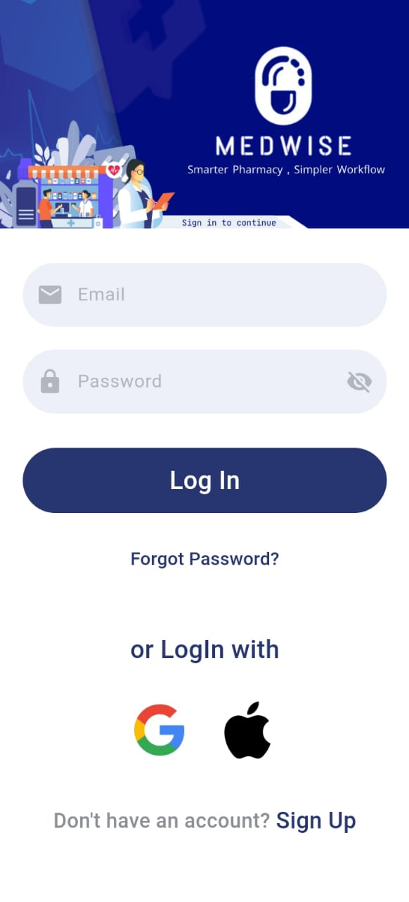
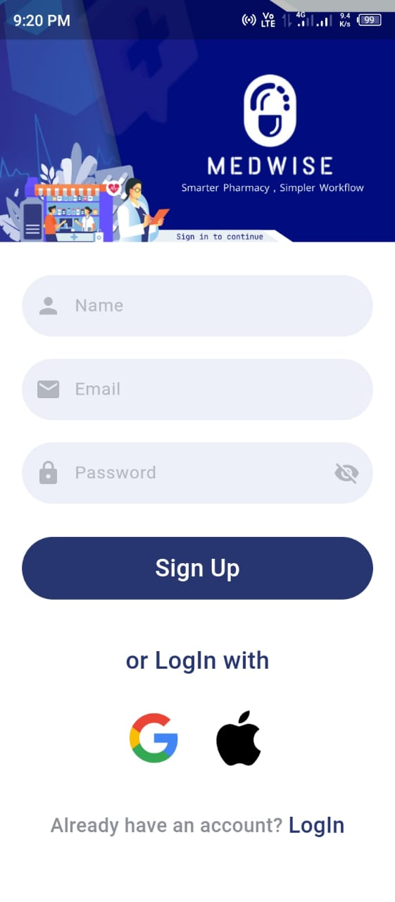
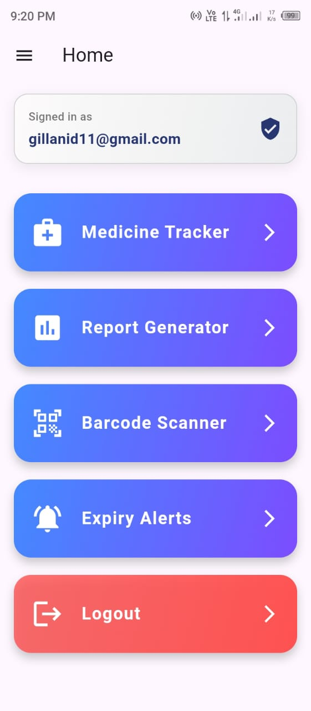

# Medwise 

A Medical Inventory Management App built using Flutter and Firebase.  
Designed to help users track, manage, and receive alerts about medicine stocks efficiently.

---

##  Features

-  User Authentication (Login, Signup, Forgot Password)
-  Add, Edit, View, Delete Medicines
-  Search & Filter by Category
-  Expiry Date Alerts
-  Reports Generation
-  Barcode Scanning
-  Export to CSV

---

##  Built With

- Flutter
- Firebase Auth & Firestore
- Dart
- CSV, Barcode, and other Flutter plugins

---

##  Screenshots

Below is a preview of the Medwise App:

  

  

  

  

---

##  Developer

**Danial Shah**  
GitHub: [@DanialShah11](https://github.com/DanialShah11)  
Email:  gillanid11@gmail.com

---

##  License
Blank...........